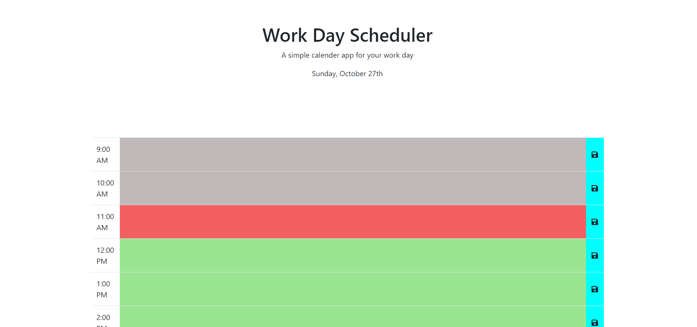

# Day Planner

This repo is for the UNCC coding bootcamp

## Instructions

Create a webpage that saves notes depending on the time block entered and saved in.

Webpage will be color coded depending on whether the represented hour is in the past, present, or future.

## Screenshot

   

### Links

[Github Repo](https://github.com/adam-lowe/HW5-Day-Planner)

[Completed Work](https://adam-lowe.github.io/Day-Planner/)
